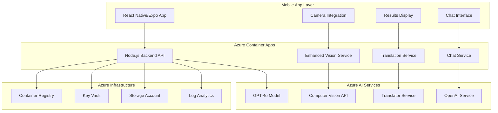
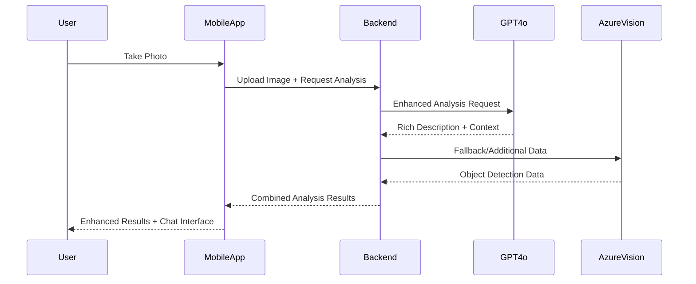

# AzureLens 🔍✨

> **A revolutionary Google Lens alternative powered by GPT-4o and Azure AI Services**

AzureLens is a comprehensive mobile application that provides intelligent image analysis, conversational AI interactions, and real-time translation capabilities. Built with cutting-edge Azure AI services and enhanced with GPT-4o for truly engaging and accurate visual understanding.

[](https://azure.microsoft.com)
[](https://openai.com)
[](https://reactnative.dev)
[](https://expo.dev)

## 🌟 Key Features

### 🧠 **GPT-4o Enhanced Vision Analysis**
- **Rich, Conversational Descriptions**: Get detailed, engaging analysis of your images
- **Context-Aware Understanding**: AI that understands scenes, objects, and relationships
- **Smart Suggestions**: Contextual follow-up questions based on image content
- **Enhanced Accuracy**: Superior object detection and scene understanding

### 💬 **Intelligent Chat Interface**
- **Image-Based Conversations**: Ask questions about your analyzed images
- **Contextual AI Responses**: GPT-4o powered chat that remembers your image context
- **Smart Suggestions**: AI-generated questions to explore your images deeper
- **Natural Language Processing**: Understand complex queries about visual content

### 🔍 **Advanced Visual Recognition**
- **Object Detection**: Identify and classify objects with high precision
- **Scene Analysis**: Understand environments, activities, and contexts
- **Text Recognition (OCR)**: Extract text from images with formatting preservation
- **Multi-language Support**: Translate text in real-time

### 📱 **Modern Mobile Experience**
- **Real-time Camera Integration**: Live image capture and analysis
- **Intuitive UI/UX**: Clean, modern interface built with React Native
- **Cross-platform**: Works on both iOS and Android via Expo
- **Offline Capabilities**: Core functionality works without internet

## 🏗️ Architecture Overview



### 🛠️ **Technology Stack**

#### Frontend (Mobile App)
- **Framework**: React Native with Expo SDK 53
- **Language**: TypeScript
- **Navigation**: Expo Router
- **UI Components**: React Native Components + Custom Design System
- **Camera**: Expo Camera with image processing
- **Networking**: Axios for API communication

#### Backend (API Services)
- **Runtime**: Node.js 18+
- **Framework**: Express.js
- **Language**: JavaScript
- **Container**: Docker containerization
- **Hosting**: Azure Container Apps

#### AI & Machine Learning
- **Primary AI**: OpenAI GPT-4o (Vision + Chat)
- **Computer Vision**: Azure AI Vision Service
- **Translation**: Azure AI Translator
- **Image Processing**: Custom enhancement pipeline

#### Azure Infrastructure
- **Compute**: Azure Container Apps (Serverless containers)
- **Registry**: Azure Container Registry
- **Security**: Azure Key Vault for secrets management
- **Storage**: Azure Blob Storage
- **Monitoring**: Azure Log Analytics + Application Insights
- **Networking**: Azure Virtual Network with private endpoints

## 🚀 Getting Started

### Prerequisites

Before you begin, ensure you have the following installed:

- **Node.js 18+** ([Download](https://nodejs.org/))
- **Azure CLI** ([Install Guide](https://docs.microsoft.com/en-us/cli/azure/install-azure-cli))
- **Azure Developer CLI (azd)** ([Install Guide](https://docs.microsoft.com/en-us/azure/developer/azure-developer-cli/install-azd))
- **Expo CLI** (`npm install -g @expo/cli`)
- **Docker** (for local development)
- **Git** for version control

### Azure Setup

1. **Login to Azure**:
   ```bash
   az login
   azd auth login
   ```

2. **Deploy Infrastructure**:
   ```bash
   # Clone the repository
   git clone https://github.com/ashburn-young/AzureLens.git
   cd AzureLens
   
   # Deploy all Azure resources
   azd up
   ```

3. **Configure OpenAI GPT-4o**:
   ```bash
   # Deploy GPT-4o model (this is done automatically by azd up)
   # The infrastructure includes OpenAI service with GPT-4o deployment
   ```

### Local Development

1. **Backend Setup**:
   ```bash
   cd backend
   npm install
   
   # Copy environment template
   cp .env.example .env
   
   # Configure your Azure credentials in .env
   # Start local development server
   npm run dev
   ```

2. **Mobile App Setup**:
   ```bash
   cd mobile-app
   npm install
   
   # Configure environment
   # .env file is already configured for deployed backend
   
   # Start Expo development server
   npx expo start --tunnel
   ```

3. **Test the Application**:
   - Scan the QR code with Expo Go app
   - Take photos and test enhanced analysis
   - Try the chat interface with AI

## 📁 Project Structure

```
AzureLens/
├── 📱 mobile-app/                # Main React Native mobile application
│   ├── app/                      # Expo Router screens
│   │   ├── (tabs)/              # Tab navigation
│   │   ├── camera.tsx           # Camera screen
│   │   └── result.tsx           # Results display
│   ├── components/              # Reusable UI components
│   │   └── ChatInterface.tsx    # Chat interface component
│   ├── src/                     # Source code
│   │   ├── services/            # API and business logic
│   │   │   ├── api.ts          # Main API service
│   │   │   └── chat.ts         # Chat service
│   │   ├── types/              # TypeScript definitions
│   │   └── config/             # App configuration
│   └── package.json            # Dependencies and scripts
│
├── 🔧 backend/                   # Node.js API backend
│   ├── src/                     # Source code
│   │   ├── services/           # Business logic services
│   │   │   └── enhancedVisionService.js  # GPT-4o integration
│   │   ├── routes/             # API endpoints
│   │   │   ├── vision.js       # Vision analysis endpoints
│   │   │   └── chat.js         # Chat endpoints
│   │   ├── config/             # Configuration
│   │   │   └── azure.js        # Azure services setup
│   │   └── utils/              # Utilities
│   ├── Dockerfile              # Container configuration
│   └── package.json           # Dependencies and scripts
│
├── 🏗️ infra/                    # Azure infrastructure (Bicep)
│   ├── main.bicep              # Main infrastructure template
│   ├── main.parameters.json    # Deployment parameters
│   └── *.bicep                # Component templates
│
├── 🚀 .github/workflows/        # CI/CD pipelines
├── 📋 azure.yaml               # Azure Developer CLI config
└── 📖 README.md               # This file
```

## 🎯 Core Features Deep Dive

### 1. **Enhanced Image Analysis with GPT-4o**

The application uses OpenAI's GPT-4o model for superior image understanding:

```javascript
// Example: Enhanced analysis with conversational output
const analysis = await enhancedVisionService.analyzeImageWithGPT4o(imageBuffer);

// Returns rich, detailed descriptions like:
{
  "title": "🏛️ Historic Architecture",
  "description": "This magnificent Gothic cathedral showcases intricate stone carvings and soaring spires...",
  "objects": ["cathedral", "stone architecture", "gothic arches"],
  "context": "Religious architecture from medieval period",
  "suggestions": [
    "Tell me about Gothic architecture",
    "What historical period is this from?",
    "Describe the architectural features"
  ]
}
```

### 2. **Intelligent Chat Interface**

Contextual conversations about your images:

```typescript
// Chat service maintains context of analyzed images
const chatResponse = await chatService.askQuestion(
  "What style of architecture is this?",
  analysisResults,
  conversationHistory
);
```

### 3. **Multi-Modal AI Pipeline**



## 🔧 Configuration & Environment

### Backend Environment Variables

```bash
# Azure OpenAI Configuration
OPENAI_API_ENDPOINT=https://your-openai-resource.openai.azure.com/
OPENAI_API_KEY=your-openai-key
OPENAI_DEPLOYMENT_NAME=gpt-4o
OPENAI_API_VERSION=2024-05-01-preview

# Azure Computer Vision
VISION_API_ENDPOINT=https://your-vision-resource.cognitiveservices.azure.com/
VISION_API_KEY=your-vision-key

# Azure Translator
TRANSLATOR_API_ENDPOINT=https://api.cognitive.microsofttranslator.com/
TRANSLATOR_API_KEY=your-translator-key

# Application Settings
PORT=3000
NODE_ENV=production
LOG_LEVEL=info
```

### Mobile App Configuration

```typescript
// src/config/index.ts
export const Config = {
  API: {
    BASE_URL: 'https://your-container-app.azurecontainerapps.io',
    TIMEOUT: 30000,
    MAX_RETRIES: 3,
  },
  CAMERA: {
    QUALITY: 0.8,
    MAX_DIMENSION: 2048,
    COMPRESSION: 0.7,
  }
};
```

## 🚀 Deployment Guide

### Automated Deployment with Azure Developer CLI

The entire solution can be deployed with a single command:

```bash
# Initialize and deploy
azd up

# This will:
# 1. Create Azure resource group
# 2. Deploy all infrastructure (Container Apps, OpenAI, etc.)
# 3. Build and push container images
# 4. Configure networking and security
# 5. Deploy GPT-4o model
# 6. Set up monitoring and logging
```

### Manual Deployment Steps

If you prefer manual deployment:

1. **Infrastructure Setup**:
   ```bash
   # Deploy Bicep templates
   az deployment group create \
     --resource-group rg-azurelens \
     --template-file infra/main.bicep \
     --parameters @infra/main.parameters.json
   ```

2. **Backend Deployment**:
   ```bash
   # Build and push container
   cd backend
   az acr build --registry your-registry --image azurelens-backend .
   
   # Update container app
   az containerapp update \
     --name ca-azurelens-backend \
     --resource-group rg-azurelens \
     --image your-registry.azurecr.io/azurelens-backend:latest
   ```

3. **Mobile App**:
   ```bash
   cd mobile-app
   npx expo start --tunnel  # For development
   # or
   eas build  # For production builds
   ```

## 🧪 Testing

### Backend API Testing

```bash
# Health check
curl https://your-app.azurecontainerapps.io/

# Vision analysis
curl -X POST https://your-app.azurecontainerapps.io/api/vision/analyze-enhanced \
  -H "Content-Type: multipart/form-data" \
  -F "image=@test-image.jpg"

# Chat endpoint
curl -X POST https://your-app.azurecontainerapps.io/api/chat/ask \
  -H "Content-Type: application/json" \
  -d '{"question": "What do you see?", "context": {...}}'
```

### Mobile App Testing

1. **Development Testing**:
   - Use Expo Go app to scan QR code
   - Test camera functionality
   - Verify API connectivity

2. **Production Testing**:
   - Build standalone apps with EAS
   - Test on physical devices
   - Performance and reliability testing

## 📊 Monitoring & Analytics

The solution includes comprehensive monitoring:

- **Application Insights**: Performance tracking and error monitoring
- **Log Analytics**: Centralized logging and querying
- **Container Insights**: Container health and resource usage
- **Azure Monitor**: Infrastructure monitoring and alerting

### Key Metrics Tracked

- **API Response Times**: Average response times for vision analysis
- **GPT-4o Usage**: Token consumption and cost tracking
- **Error Rates**: Failed requests and error patterns
- **User Engagement**: Feature usage and session duration

## 💰 Cost Optimization

### Estimated Monthly Costs (USD)

| Service | Usage | Estimated Cost |
|---------|-------|----------------|
| Azure Container Apps | 1M requests/month | $15-30 |
| OpenAI GPT-4o | 10K image analyses | $50-100 |
| Computer Vision API | 1K requests | $1-2 |
| Translator API | 1M characters | $10 |
| Storage & Networking | Standard usage | $5-10 |
| **Total** | | **$80-150/month** |

### Cost Optimization Tips

1. **Implement Caching**: Cache frequent analyses to reduce API calls
2. **Image Optimization**: Compress images before sending to APIs
3. **Request Batching**: Batch multiple requests when possible
4. **Monitoring**: Set up cost alerts and budgets
5. **Scaling**: Use auto-scaling to match demand

## 🔒 Security & Compliance

### Security Features

- **Azure Key Vault**: Secure storage of API keys and secrets
- **Managed Identity**: Secure authentication between Azure services
- **Private Endpoints**: Secure network communication
- **HTTPS Only**: All communication encrypted in transit
- **Input Validation**: Comprehensive input sanitization
- **Rate Limiting**: Protection against abuse and overuse

### Compliance Considerations

- **Data Privacy**: No persistent storage of user images
- **GDPR Compliance**: Data processing transparency
- **Content Filtering**: Azure AI Content Safety integration
- **Access Controls**: Role-based access to Azure resources

## 🤝 Contributing

We welcome contributions! Please follow these guidelines:

1. **Fork the Repository**
2. **Create Feature Branch**: `git checkout -b feature/amazing-feature`
3. **Commit Changes**: `git commit -m 'Add amazing feature'`
4. **Push to Branch**: `git push origin feature/amazing-feature`
5. **Open Pull Request**

### Development Guidelines

- Follow TypeScript/JavaScript best practices
- Write comprehensive tests
- Update documentation
- Follow existing code style
- Test on multiple devices

## 📝 Changelog

### v2.0.0 - GPT-4o Enhancement (Current)
- ✨ **NEW**: GPT-4o powered image analysis
- ✨ **NEW**: Intelligent chat interface
- ✨ **NEW**: Context-aware AI suggestions
- 🔧 **IMPROVED**: Enhanced accuracy and engagement
- 🔧 **IMPROVED**: Modern UI/UX design
- 🔧 **IMPROVED**: Performance optimizations

### v1.0.0 - Initial Release
- 📸 Basic image analysis with Computer Vision
- 🔤 OCR and text translation
- 📱 React Native mobile app
- ☁️ Azure infrastructure deployment

## 🆘 Troubleshooting

### Common Issues

1. **"blob.arrayBuffer is not a function"**
   - Fixed in v2.0.0 - Update to latest version

2. **API Timeout Errors**
   - Check Azure service health
   - Verify network connectivity
   - Increase timeout values in config

3. **Expo Build Failures**
   - Clear Expo cache: `npx expo start --clear`
   - Check Node.js version compatibility
   - Verify all dependencies are installed

4. **Azure Deployment Issues**
   - Verify Azure CLI authentication
   - Check resource quotas and limits
   - Review deployment logs in Azure Portal

### Getting Help

- 📖 **Documentation**: Check this README and inline code comments
- 🐛 **Issues**: Create GitHub issues for bugs and feature requests
- 💬 **Discussions**: Use GitHub Discussions for questions
- 📧 **Contact**: ashburnyoung@outlook.com

## 🙏 Acknowledgments

- **Microsoft Azure**: For the robust cloud infrastructure
- **OpenAI**: For the incredible GPT-4o model
- **Expo Team**: For the excellent React Native development platform
- **Open Source Community**: For the amazing tools and libraries

## 📄 License

This project is licensed under the MIT License - see the [LICENSE](LICENSE) file for details.

---

<div align="center">

**Built with ❤️ by [Ashburn Young](https://github.com/ashburn-young)**

[](https://github.com/ashburn-young/AzureLens)
[](https://linkedin.com/in/ashburn-young)

*Transforming visual understanding with AI* 🔍✨

</div>
